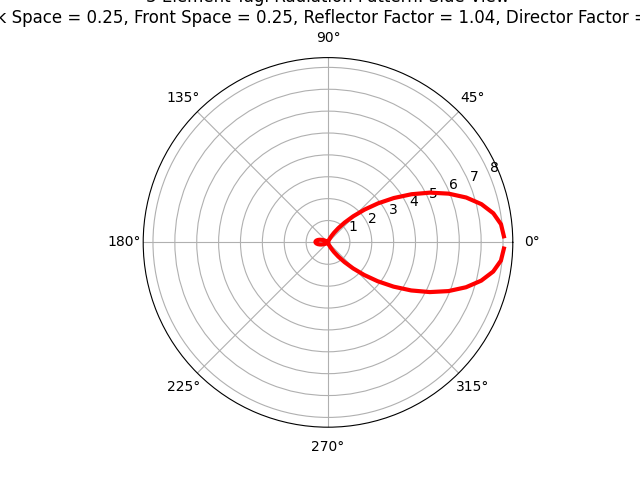
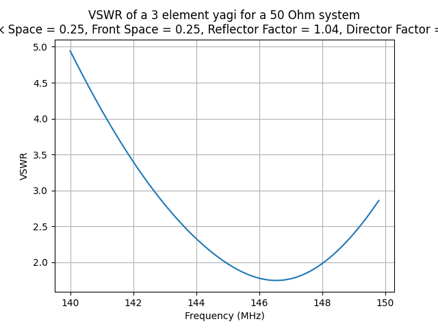

### Antenna Simulation Using PyNEC
The Scripts here are based on examples in the PyNEC repo: https://github.com/tmolteno/python-necpp.

I wanted to add some comments to make the functions easier for me to use and to be able to scale and adjust various basic antenna configurations. 

To create the virtual environment in which to run the examples, do the following:

<code>
virtualenv .venv -p python3 
source .venv/bin/activate 
pip install -r requirements.txt
</code>

